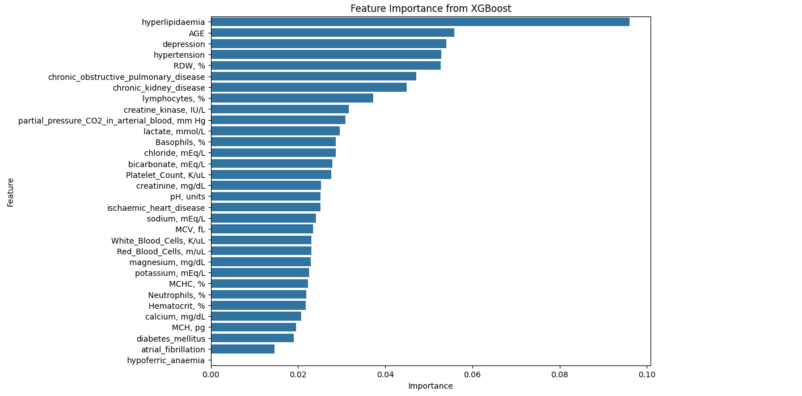
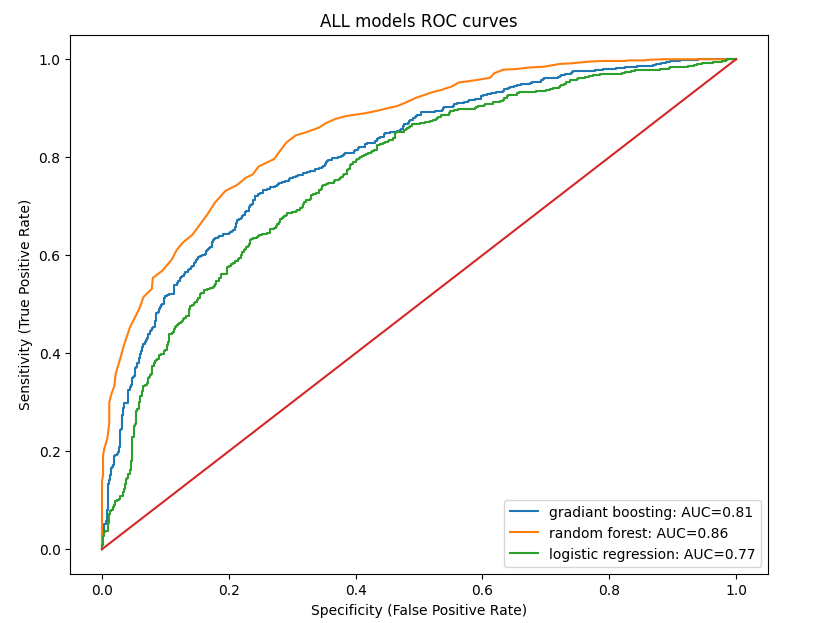

# ICU Patients Mortality Prediction

This repository contains the implementation of a machine learning model for predicting in-hospital mortality among ICU patients with heart failure, based on data from the MIMIC-III database. The project uses demographic, vital signs, comorbidity, and lab data to build a robust predictive model.

## Project Objectives
- Develop a model to predict in-hospital mortality for ICU patients with heart failure.
- Identify significant features impacting mortality.
- Compare the performance of different machine learning algorithms.

## Data Source
- **MIMIC-III Database**: Includes clinical data of ICU patients.
- **Key Features**:
  - **Demographics**: Age, gender, ethnicity, etc.
  - **Vital Signs**: Heart rate, blood pressure, respiratory rate, etc.
  - **Comorbidities**: Diabetes, hypertension, ischemic heart disease, etc.
  - **Laboratory Results**: Blood glucose, creatinine levels, etc.

## Data Preprocessing

**Final Dataset Shape**: 7,280 rows × 37 columns.

## Exploratory Data Analysis
- Descriptive statistics for central tendency measures (mean, median, mode).
- Visualized distributions of age, gender, and ethnicity.
- Analyzed mortality distribution across demographic groups.
- Used correlation matrices and visualizations (bar plots, box plots) to explore relationships.

## Feature Selection
- Applied Random Forest and XGBoost for feature importance analysis.
- Key features identified: Hyperlipidaemia, Age, RDW,  Depression, Hypertension, etc.
- Combined feature rankings for enhanced interpretability.

## Modeling Techniques
1. **Logistic Regression**:
   - Accuracy: 77%.
2. **Random Forest**:
   - Accuracy: 86% (best performer).
3. **Gradient Boosting**:
   - Accuracy: 81%.
4. Compared models using ROC curves for true/false positive rate analysis.

## Results
- Random Forest achieved the highest accuracy and AUC.
- Age, RDW, and creatinine levels were the most significant predictors.

## Future Prospects
- Validate the model on larger datasets.
- Implement in clinical settings for decision support.
- Explore advanced features and modeling techniques for improved predictions.
